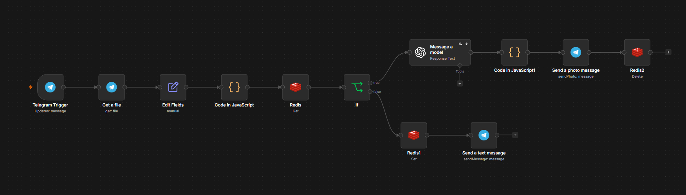

# ⚡ سیستم هوشمند پرو مجازی لباس برای ووکامرس و فروشگاه‌های آنلاین

🚀 **یک فلو آنلاین در n8n برای پرو اختصاصی لباس روی مدل انسانی با استفاده از هوش مصنوعی ، مدیریت وضعیت و پیام‌رسان تلگرام**

✅ **بدون نیاز به آتلیه و عکاسی پرهزینه** | ✅ **کاملاً خودکار و هوشمند** | ✅ **کاهش ۹۰٪ زمان و هزینه تولید محتوای پوشاک**

---

## 🎬 دموی کامل فرآیند


https://github.com/user-attachments/assets/354b0b67-51da-432b-a07a-f92baa40bfe4


> 🔄 **در این ویدیو می‌بینید:** چطور کاربر عکس لباس و کد محصول را ارسال کرده، سپس با ارسال عکس مدل خود، تنها در چند ثانیه خروجی پرو بسیار طبیعی و باکیفیت را در تلگرام تحویل می‌گیرد.

---

## 🧩 معماری ورکفلو (ساختار گره‌ها در n8n)



> 📌 **توضیح ورکفلو:** این زنجیره هوشمند با دریافت عکس محصول از تلگرام شروع شده، داده‌ها را در دیتابیس Redis مدیریت کرده و پس از فراخوانی مدل پردازش تصویر Gemini AI، خروجی نهایی پرو شده را مجدداً به تلگرام ارسال می‌کند.

---

## 🎯 این پروژه دقیقاً چه مشکلی را حل می‌کند؟

در فروشگاه‌های اینترنتی پوشاک و ووکامرس، یکی از بزرگ‌ترین چالش‌ها **هزینه‌ بالای عکاسی مدلینگ، اجاره آتلیه و زمان‌بر بودن آماده‌سازی تصاویر** است. همچنین مشتریان همواره تمایل دارند لباس‌ها را روی تن یک مدل واقعی ببینند.

این پروژه با اتصالات اتوماتیک n8n، فرآیند پرو لباس را کاملاً مدرن می‌سازد. تنها با ارسال عکس لباس و عکس مدل، الگوریتم هوش مصنوعی جزییات پارچه، نور، چین و چروک و استایل لباس را با فرم بدن مدل تطبیق داده و خروجی حرفه‌ای ادمین یا مشتری تحویل می‌دهد.

> 💡 **کاربرد ویژه برای آنلاین‌شاپ‌ها و آژانس‌های وب:** این قابلیت را می‌توان مستقیم به ربات‌های پشتیبانی، فرم‌های ووکامرس یا اپلیکیشن‌های اختصاصی متصل کرد تا فرآیند بازاریابی visual فروشگاه را به سطح جدیدی ببرد.

---

## 🔄 گردش کار (چطور کار می‌کند؟)

این فلوی n8n شامل یک زنجیره کاملاً بهینه از اقدامات زیر است:

1. 📥 **دریافت عکس لباس (Step 1):** دریافت تصویر لباس به همراه کد/ID محصول در کاپشن از طریق تلگرام (`Telegram Trigger`).
2. ⚙️ **پردازش باینری داده (JavaScript):** تبدیل فایل تصویر دریافتی به فرمت Base64 جهت آماده‌سازی ارسال به AI.
3. 💾 **ذخیره‌سازی وضعیت در Redis:** ذخیره موقت تصویر لباس و کد محصول در دیتابیس Redis با ساختار `user_<chat_id>` و دارای TTL (انقضای اتوماتیک ۳۰ دقیقه‌ای).
4. 📸 **درخواست عکس مدل (Step 2):** ارسال پیام خودکار به کاربر جهت ارسال عکس مدل انسانی.
5. 🤖 **پردازش تصویر با Gemini Vision AI:** ترکیب هوشمندانه تصویر لباس و مدل با حفظ بافت پارچه، رنگ و نورپردازی طبیعی.
6. 🔄 **تبدیل خروجی به باینری:** تبدیل مجدد پاسخ Base64 هوش مصنوعی به فایل تصویری JPEG.
7. 📤 **ارسال خروجی به کاربر:** تحویل عکس نهایی پرو شده در تلگرام و پاکسازی (Delete) کلید وضعیت کاربر در Redis.

---

## 🛠️ ابزارها و سرویس‌های استفاده‌شده

| ابزار | کاربرد |
| :--- | :--- |
| **n8n ⚡** | هسته اصلی اتوماسیون و مدیریت گره‌ها |
| **Telegram Bot API 🤖** | رابط کاربری و دریافت/ارسال تصاویر و پیام‌ها |
| **Redis ⚡** | دیتابیس In-Memory برای مدیریت وضعیت (State Management) کاربر |
| **Gemini 3.1 Vision AI 🎨** | موتور هوش مصنوعی برای پردازش، ترکیب و پرو واقع‌گرایانه لباس |
| **JavaScript (Node.js) ⚙️** | پردازش پیشرفته Streamهای باینری و Base64 |

---

## 💼 سناریوهای واقعی استفاده در آژانس‌های طراحی سایت & فروشگاه‌ها

این پروژه صرفاً یک ربات ساده نیست؛ بلکه هسته اصلی آن برای انواع زیرساخت‌ها قابل شخصی‌سازی است:

- **اتصال به ووکامرس (WooCommerce):** افزودن دکمه "پرو آنلاین" در صفحه محصولات پوشاک و ارسال پاسخ به ایمیل یا اکانت کاربر.
- **ربات فروشگاهی و تلگرامی:** ارائه سرویس پرو اختصاصی به مشتریان قبل از خرید جهت افزایش نرخ تبدیل فروش.
- **تولید محتوای سریع شبکه اجتماعی:** عکاسی از ۱۰۰ مدل لباس مختلف روی یک مدل واحد تنها در چند دقیقه بدون هزینه عکاسی!

---

## 🔐 متغیرهای محیطی (پیکربندی امن)

برای اجرا، تنها کافی است مقادیر زیر را در Credentialهای n8n و محیط اجرا تنظیم کنید:

```env
TELEGRAM_BOT_TOKEN=your_telegram_bot_token
REDIS_HOST=your_redis_host
REDIS_PORT=6379
REDIS_PASSWORD=your_redis_password
OPENAI_API_KEY=your_gemini_or_openai_api_key
